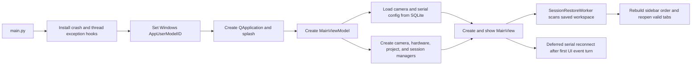
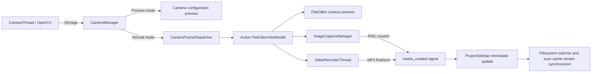
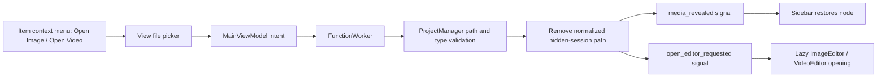

# VCA Optima / TNH Optima — Release 1.1.2

## Project Overview

VCA Optima is the repository name; the desktop application is branded **TNH Optima** in the executable, window title, taskbar identity, and installer. It is a Windows-oriented PyQt6 application for:

- acquiring monochrome or RGB frames from a camera;
- capturing lossless PNG images and recording MP4 video;
- controlling a serial-connected actuator;
- organizing work as Projects and Items;
- viewing images, videos, and UTF-8 text files; and
- measuring the left and right liquid-droplet contact angles from a manually selected or automatically detected droplet profile.

The codebase follows an MVVM separation:

- `Presentation/Views` owns widgets, GUI-only rendering, dialogs, and user interaction;
- `Presentation/ViewModels` owns presentation state, validation, background-task orchestration, and queued result signals;
- `Models` owns project, device, media, and numerical-analysis logic;
- `Infrastructure` owns paths, SQLite persistence, resources, crash logging, and Windows taskbar integration; and
- `ReSource` contains QSS and bundled image/icon assets.

Views do not instantiate Models or worker threads. `MainViewModel` exposes manager operations and relays manager signals, while feature/dialog ViewModels own their workers. GUI-only `QPixmap`, `QPainter`, Matplotlib canvas, `QMediaPlayer`, and `QVideoWidget` work stays in the View. Filesystem I/O, image conversion, codec finalization, serial commands, directory scans, session shutdown work, and numerical analysis run outside the GUI thread through ViewModel-owned workers and queued Qt signals.

The runtime stack is Python 3, PyQt6, OpenCV, NumPy, SciPy, Matplotlib, pyserial, SQLite, and Send2Trash/pywin32 for native Windows Recycle Bin operations. `main.py` is the application entry point. PyInstaller uses `TNH_Optima.spec`, and `installer.iss` packages the resulting onedir build with Inno Setup.

### On-disk project contract

```text
<Project>/
├── config.json                 # Marks a Project root
└── <Item>/
    ├── Image/                  # PNG/JPG/BMP/GIF media
    └── Video/                  # MP4/AVI/MOV/MKV/FLV media
```

A valid Item is a direct child of its Project and must contain both `Image/` and `Video/`. New unsaved Projects are created under the current Windows Documents known folder:

```text
<Documents>/TNH Optima Projects/<ProjectName>/
```

They remain internally marked `TEMP` until **Save As** copies them to a user-selected directory and marks them `SAVED`.

Application state is not written into the source tree. Configuration and session databases live under:

```text
%LOCALAPPDATA%/TNH Optima/Data/
├── ConfigStorage.db
└── SessionData.db
```

Logs live under `%LOCALAPPDATA%/TNH Optima/Logs/`.

### Current implementation boundaries

- Image and droplet coordinates are mapped to a fixed physical field of `5.0 mm × 3.0 mm`; there is no runtime spatial-calibration model.
- **Double Points** is the implemented baseline method. **Mirror Image Method** is a placeholder and always reports unavailable.
- **Young-Laplace Fit** is currently a circular-cap least-squares approximation; it does not solve the gravity-dependent Young-Laplace differential equation.
- The hardware `query_period` value is persisted and displayed but is not used by a periodic status-query loop.
- The directory is named `Release_1.1.2`, while `installer.iss` still declares installer version `1.1.1`.
- The present tests cover path safety, recoverable deletion and Sidebar-only removal, loading lifecycles, sidebar scanning, lazy video playback, frame capture, MVVM boundaries, background droplet work, and screen fitting. They do not yet provide numerical regression tests for contact-angle accuracy.

## Annotated Directory Structure

```text
.
├── main.py
│   └── Installs crash hooks, initializes the Windows taskbar identity,
│       shows the splash screen, then creates MainViewModel and MainView.
├── requirements.txt            # Pinned runtime/build dependencies.
├── TNH_Optima.spec             # PyInstaller onedir build and bundled resources.
├── installer.iss               # Inno Setup definition.
├── build_installer.py          # Validates the PyInstaller output before packaging.
├── tests/
│   ├── test_path_handling.py
│   │   └── Canonicalization, containment, Documents resolution, and Project paths.
│   ├── test_loading_signals.py
│   │   └── Balanced background-loading begin/end signals.
│   ├── test_sidebar_loading.py
│   │   └── Shimmer lifecycle and bounded media-scan queue behavior.
│   └── test_video_editor_capture.py
│       └── Lazy decoder allocation, single-active-video policy, and frame export.
├── Document/                   # Design/reference documents and screenshots; not runtime code.
└── App/
    ├── Infrastructure/
    │   ├── CrashHandler.py
    │   │   └── Rotating Python logs, thread hooks, faulthandler, and error dialog fallback.
    │   ├── Helpers/
    │   │   ├── PathHelper.py
    │   │   │   └── Windows Documents lookup, canonical paths, containment, media-to-Item resolution.
    │   │   ├── RecycleBinHelper.py
    │   │   │   └── Native recoverable deletion with no permanent-delete fallback.
    │   │   ├── ResourceHelper.py
    │   │   │   └── Source/PyInstaller resource paths and cached QSS loading.
    │   │   └── WindowOwnershipHelper.py
    │   │       └── AppUserModelID, taskbar styles, and available-screen window fitting.
    │   ├── Repositories/
    │   │   ├── ConfigRepository.py
    │   │   │   └── SQLite key/value camera and serial configuration.
    │   │   ├── SessionRepository.py
    │   │   │   └── JSON-encoded SQLite session records.
    │   │   └── StoragePath.py
    │   │       └── Per-user database paths and one-time legacy database migration.
    │   └── Persistence/
    │       └── Compatibility location for legacy databases; runtime databases are per-user.
    ├── Models/
    │   ├── ProjectManager.py
    │   │   └── Thread-safe Project/Item/media filesystem operations and TEMP/SAVED state.
    │   ├── SessionManager.py
    │   │   └── Open Projects, tabs, visible Items/media, expanded paths, and sidebar order.
    │   ├── CamHardwareManager.py
    │   │   └── Transaction-like camera preview/apply/revert and hardware configuration adapters.
    │   ├── ControlPanelManager.py
    │   │   └── Input normalization and actuator packet construction.
    │   ├── Controllers/
    │   │   ├── HardwareConnector.py
    │   │   │   └── Thread-safe singleton serial connection, retries, cancellation, and writes.
    │   │   └── HardwareManager.py
    │   │       └── QObject facade for serial configuration, status signals, and cleanup.
    │   ├── Vision/
    │   │   ├── CameraManager.py
    │   │   │   └── Camera lifecycle, reference counting, switching, retry, and frame routing.
    │   │   ├── CameraThread.py
    │   │   │   └── OpenCV capture loop that emits copied QImage frames and measured FPS.
    │   │   ├── HardwareCameraScan.py
    │   │   │   └── DirectShow enumeration with an OpenCV probe fallback.
    │   │   └── CameraFrameDispatcher.py
    │   │       └── Sends the latest frame only to the active frame-capable ViewModel.
    │   ├── MediaUtils/
    │   │   ├── MediaManager.py
    │   │   │   └── Facade for still capture and video recording.
    │   │   ├── ImageCaptureManager.py
    │   │   │   └── Timestamped lossless PNG capture into an Item's Image folder.
    │   │   └── VideoRecorderManager.py
    │   │       └── Bounded frame queue, MP4 encoding thread, and recording state machine.
    │   └── Analysis/
    │       ├── AnalysisManager.py
    │       │   └── Baseline/fitter selection facade.
    │       ├── BaselineAnalysis.py
    │       │   └── Two-point line construction; mirror method placeholder.
    │       └── DropletAnalysis.py
    │           └── Edge detection, ellipse/circle fitting, intersections, tangents, and angles.
    ├── Presentation/
    │   ├── ViewModels/
    │   │   ├── MainViewModel.py
    │   │   │   └── Application composition, background filesystem work, config, and session flow.
    │   │   ├── Workers.py
    │   │   │   └── Generic worker, restore/file workers, UTF-8 loader, and atomic text save.
    │   │   ├── FeatureViewModel/
    │   │   │   ├── FileEditorViewModel.py
    │   │   │   │   └── Live frames, serialized motor commands, capture/record, and safe close.
    │   │   │   ├── ImageEditorViewModel.py
    │   │   │   │   └── Asynchronous QImage decode/save with stale-request cancellation.
    │   │   │   ├── VideoEditorViewModel.py
    │   │   │   │   └── Background video validation and captured-frame file export.
    │   │   │   ├── SidebarViewModel.py
    │   │   │   │   └── Bounded media-scan queue, stale-refresh coalescing, and shutdown.
    │   │   │   └── DropletAnalysisViewModel.py
    │   │   │       └── Image conversion, analysis algorithms, downsampling, export, and worker lifecycle.
    │   │   └── DialogViewModel/
    │   │       └── Small adapters/state holders for camera, serial, motor, save, and delete dialogs.
    │   └── Views/
    │       ├── MainView.py
    │       │   └── Main shell, editor rendering/restoration, active-video policy, and responsive sizing.
    │       ├── MenuBar.py
    │       │   └── Composes the active File, Setup, and Control menus.
    │       ├── Dialog/
    │       │   ├── ConfigCameraDialog.py
    │       │   ├── ConfigHardwareDialog.py
    │       │   ├── MotorControlDialog.py
    │       │   ├── DeleteResourcesDialog.py
    │       │   └── SaveResourcesDialog.py
    │       └── Widgets/
    │           ├── SideBar.py
    │           │   └── Project tree, reordering, filesystem watchers, and scan rendering/cache.
    │           ├── EditorWorkspace.py
    │           │   └── Editor tabs, file drops, duplicate-path detection, and tab closing.
    │           ├── DropletAnalysisWindow.py
    │           │   └── Interactive baseline/profile tools and GUI-only overlay rendering.
    │           ├── StatusBar.py
    │           │   └── Camera and serial connection indicators.
    │           ├── FileEditorWorkspace/
    │           │   ├── FileEditor.py
    │           │   │   └── Live camera preview with motor and capture controls.
    │           │   ├── ImageEditor.py
    │           │   │   └── Lightweight Qt image viewer, save, and analysis launch.
    │           │   ├── ImageCanvas.py
    │           │   │   └── QPainter viewport with 5 × 3 mm axes, zoom, and pan.
    │           │   ├── VideoEditor.py
    │           │   │   └── Lazy multimedia stack, seeking/rate control, and timestamped capture.
    │           │   ├── MediaControlEditor.py
    │           │   │   └── Capture/record/pause/resume/stop controls.
    │           │   └── MotorControlEditor.py
    │           │       └── Height/speed inputs and direction/stop controls.
    │           └── MenuBar/
    │               └── QAction implementations, shortcuts, sidebar toggle, and inactive placeholders.
    └── ReSource/
        ├── Styles/              # QSS separated by window/editor/dialog.
        └── Icon/                # Application ICO, splash PNG, and feature-grouped SVG assets.
```

## Core Algorithms & Implementation

### 1. Coordinate system and baseline

Both image display and droplet analysis use the physical extent `x ∈ [0, 5] mm`, `y ∈ [0, 3] mm`. For an image of width `W` and height `H`, edge detection maps a pixel `(x_px, y_px)` to:

```text
x = x_px × 5 / (W - 1)
y = 3 - y_px × 3 / (H - 1)
```

The reversed `y` term converts the top-down image axis to an upward physical axis.

For two distinct baseline points `P1=(x1,y1)` and `P2=(x2,y2)`, `BaselineAnalyzer` constructs:

```text
a = y2 - y1
b = -(x2 - x1)
c = (x2 - x1)y1 - (y2 - y1)x1

baseline: ax + by + c = 0
```

Coincident points are rejected. Automatic edge detection additionally rejects a vertical baseline because it must evaluate `y_baseline(x) = -(ax+c)/b`.

### 2. Baseline-constrained automatic edge detection

`auto_detect_edge_points()` isolates the liquid cap before fitting:

1. Validate the requested point count, fixed physical dimensions, and finite baseline.
2. Convert the input to contiguous grayscale `uint8`; normalized `[0,1]` input is expanded to `[0,255]`.
3. Build a physical half-plane mask for pixels on or above the user baseline.
4. Apply a `7×7` Gaussian blur, set the excluded half-plane to white, and run inverse Otsu thresholding.
5. Apply morphological close with an image-scaled odd kernel clamped to `3..9`, followed by a `3×3` open.
6. Extract external contours and reject components that are too small, too flat, or lack a continuous arc above the baseline margin.
7. For each candidate, keep the longest continuous valid contour run by geometric arc length.
8. Use the clearance profile from the baseline to find the apex, remove low-clearance substrate tails, and reconstruct the left/right contact endpoints.
9. Estimate each endpoint by a local least-squares model of `x` versus baseline clearance. The two manually selected baseline anchors may replace these estimates when they are sufficiently close.
10. Score candidates primarily by arc length and cap height, select the best cap, then resample it at uniform arc-length intervals.
11. Convert samples back to physical coordinates and return only points strictly above the baseline.

This ordering prevents the substrate and reflected droplet from dominating the binary component before contour selection.

### 3. Ellipsoid Fit: direct initialization plus robust weighted refinement

Despite the UI name “Ellipsoid,” the implemented 2-D model is a rotated ellipse:

```text
u =  (x-x0)cos(theta) + (y-y0)sin(theta)
v = -(x-x0)sin(theta) + (y-y0)cos(theta)

(u/a)^2 + (v/b)^2 = 1
```

The fit has two stages:

1. **Fitzgibbon direct ellipse initialization**
   - Construct the design matrix row `[x², xy, y², x, y, 1]`.
   - Solve the generalized eigenproblem from `DᵀD` and the ellipse constraint matrix.
   - Retain real finite eigenvectors satisfying `4AC-B² > 0`.
   - Select the valid eigenvector with the smallest absolute eigenvalue.
   - Normalize by `A+C`, convert the conic to center, semi-axes, and rotation, and normalize the result so `a ≥ b`.
   - If direct fitting fails, fall back to the point centroid and half-ranges.

2. **Weighted robust least squares**
   - Evaluate the implicit ellipse error `f=(u/a)²+(v/b)²-1`.
   - Divide by the norm of its world-coordinate gradient, producing a Sampson-like, scale-aware residual.
   - Compute each point's perpendicular distance `d` to the baseline.
   - Normalize `d` by `max(percentile75(d), 0.25×max(d), 1e-6)`.
   - Weight the residual with `w=clip(exp(-25×d_norm²), 1e-4, 1)`, emphasizing the contact-line region.
   - Refine `(x0,y0,a,b,theta)` with SciPy `least_squares`, positive semi-axis bounds, `soft_l1` loss, and a bounded rotation.

At least five profile points are required for this path.

### 4. “Young-Laplace Fit” circular approximation

The alternative fitter estimates `(x0,y0,R)` by minimizing the radial geometric residual:

```text
sqrt((x-x0)^2 + (y-y0)^2) - R
```

The initial center is the point centroid and the initial radius is the mean radial distance. At least three points are required. This is useful as a small-droplet circular approximation, but it is not a full Young-Laplace solver.

### 5. Contact intersections, tangent orientation, and inside-liquid angle

After fitting, the code:

1. Solves the baseline–ellipse or baseline–circle intersection analytically.
2. Sorts the two intersections by `x` into left and right contact points.
3. Defines the wetted-footprint midpoint between them.
4. Determines which side of the baseline contains the liquid using an apex/reference point.
5. Evaluates neighboring points at `t+ε` and `t-ε` on the actual parametric curve.
6. Chooses the tangent direction whose neighboring curve point lies deeper on the liquid side; an apex-distance test resolves numerical ties.
7. Orients the baseline direction from each contact point toward the footprint midpoint.
8. Computes the internal angle with a clamped dot-product `arccos`, yielding a value in `[0°,180°]`.

Following the actual curve branch is important: stepping along an unoriented tangent line can swap an obtuse angle with its `180°-θ` complement.

The result dictionary contains:

```text
left_angle, right_angle,
left_point, right_point,
left_tangent, right_tangent
```

`DropletAnalysisWindow` draws these values as contact markers, inward baseline segments, tangent arrows, arcs, and labels. `DropletAnalysisViewModel` owns baseline computation, edge detection, curve fitting, and file export. It downsamples only the display/heatmap arrays while retaining the full-resolution source for analysis. The View renders a GUI-owned canvas snapshot; PNG encoding, directory creation, and the collision-free timestamped write run in a worker.

### 6. Camera acquisition and frame dispatch

- Camera enumeration uses DirectShow device names through `pygrabber` on Windows. If enumeration is unavailable, OpenCV probes indices `0..4`.
- `CameraThread` opens the selected device, applies the configured resolution, measures FPS, converts BGR frames to copied RGB `QImage` objects, and releases `VideoCapture` in `finally`.
- `CameraManager` owns one capture thread, switches cameras only after the previous thread finishes, retries camera errors up to five times with a one-second `QTimer`, and uses a reference count so the live camera stops when no File Editor requires it.
- Preview mode routes frames to the camera configuration dialog; normal mode routes them through `CameraFrameDispatcher`.
- The dispatcher caches the last frame and sends it only to the active object exposing `receive_frame()`. This avoids duplicating every camera frame across inactive editors.

### 7. Image capture, video recording, and playback

Live still capture copies the current `QImage` and writes a timestamped lossless PNG into `<Item>/Image/`.

Static image loading follows a two-stage boundary:

- `ImageEditorViewModel` decodes the file as a `QImage` in a worker and ignores superseded requests.
- `ImageEditor` creates the GUI-owned `QPixmap` once, then `ImageCanvas` renders it directly with `QPainter`.
- Restored background tabs keep only their source path; `showEvent` starts decoding when a tab first becomes visible.
- The canvas crops the source pixmap for zoom/pan while preserving the fixed `5 mm × 3 mm` coordinate view. It does not convert the image to NumPy or rebuild a Matplotlib figure on the GUI thread.

Video recording uses a three-state machine: `idle → recording ↔ paused → idle`.

- `VideoRecorderThread` owns OpenCV's `VideoWriter` and creates it lazily from the first valid frame.
- Frames are copied into `deque(maxlen=5)`.
- If encoding falls behind, all stale queued frames are discarded and only the newest frame is written.
- Output uses the `mp4v` codec, the captured frame dimensions, and the camera-reported FPS.
- Stop/finalization runs outside the GUI thread; a `media_created` signal is emitted only after the MP4 exists.

Video playback is deliberately lazy:

- Opening or restoring a tab creates only lightweight controls and records the path; neither `QMediaPlayer` nor `QVideoWidget` is constructed and `setSource()` is not called.
- On Play, `VideoEditorViewModel` validates the path and performs potentially slow filesystem metadata I/O in a worker.
- Only after validation does the View construct the GUI-owned multimedia objects; Qt Multimedia then opens the source asynchronously.
- Before one video starts, `MainView` pauses every other video and releases its decoder while retaining its resume position.
- Capturing a playback frame overlays the current timestamp. Project videos save to the sibling `Image/` directory, creating it if necessary; external videos use a Save As dialog. Directory creation, PNG encoding, and writing are owned by `VideoEditorViewModel` and run in a worker.

### 8. Serial actuator protocol

`HardwareConnector` is a process-wide, thread-safe singleton. A connection-generation counter cancels superseded connect attempts. Serial opens use bounded read/write timeouts and retry Windows access-denied failures up to three times.

`ControlPanelManager` normalizes:

```text
Slow   -> 50
Medium -> 150
Fast   -> 300
numeric speed -> non-negative integer
invalid speed -> 100
distance -> integer, or 0 when invalid
```

Commands use:

```text
#<direction>,<distance>,<speed>,<stop_step>!
```

Concrete packets are:

```text
Move up:   #CCW,<distance>,<speed>,0!
Move down: #CW,<distance>,<speed>,0!
Stop:      #CW,0,0,-1!
```

File Editor and Motor dialog commands run in serialized background queues. Stop is inserted at the front of the pending queue.

### 9. Project, file, session, and UI lifecycle

- Project/filesystem mutations are protected by a re-entrant lock.
- Names reject empty values, path components, Windows-reserved filename characters, and trailing space/dot.
- Canonical containment uses `realpath`, `normcase`, and `commonpath`, preventing `..` escapes and shared-prefix sibling confusion.
- Copy collisions receive `_CopyN`; Cut/Move is implemented as copy followed by permanent cleanup of only the duplicated source.
- Every Project, Item, Image, and Video delete dialog uses the existing disk-content checkbox. With the checkbox clear, the resource is removed from the Sidebar/workspace only and its content remains on disk. With it checked, the filesystem operation runs in a background worker and sends the file or directory to the Windows Recycle Bin. If recycling fails or its dependency is unavailable, the original content is retained; user-initiated deletion never falls back to permanent removal.
- Media files removed from the Sidebar are stored as normalized hidden paths in the session. Both the initial directory scan and later `QFileSystemWatcher` refreshes filter those paths, preventing a kept-on-disk file from reappearing unexpectedly.
- An Item's context menu provides `Open Image...` and `Open Video...`. The View only gathers the selected path; `MainViewModel` dispatches validation to a worker, `ProjectManager` verifies that the file is directly inside the correct Item media folder, and a successful result removes its hidden-session entry before signals restore the Sidebar node and open the editor.
- UTF-8 text loads are capped at `20 MB`, rendered into the editor in `64 KiB` chunks, and saved atomically through a same-directory temporary file plus `os.replace`.
- `SidebarViewModel` owns a media-scan queue limited to two workers, coalesces repeated watcher refreshes, and returns names to the View. `ProjectSidebar` caches each directory and renders at most 200 tree nodes per event-loop turn. `QFileSystemWatcher` handles external changes; explicit `media_created` signals make in-app captures visible immediately.
- Sidebar drag/drop reorders Projects at the root or Items within the same Project. It changes display/session order only; it does not move directories on disk.
- Session restore validates existing paths, reconstructs Projects/Items in saved order, then reopens valid editor tabs one event-loop turn at a time so tab construction cannot monopolize the GUI thread.
- Close operations are cooperative and non-blocking: Views never call `QThread.wait()` on the GUI thread. Editors defer destruction while ViewModel workers or recording finalization remain active. Final camera shutdown, serial disconnect, and session persistence complete asynchronously, then a queued signal retries the close automatically.
- `FileEditorWindow` and `DropletAnalysisWindow` are sized once against the active screen's `availableGeometry()`, capped at `94% × 90%`, centered, and given a screen-safe minimum. This keeps them inside the work area on small displays and multi-monitor setups.

## Data Flow

### Application startup and restoration



### Live acquisition and media creation



### Droplet analysis


### Project and session changes


### Reopen media removed from the Sidebar



The signal/worker boundary is the central concurrency rule: Views update GUI objects only on the Qt GUI thread; ViewModels own task lifecycles and queued result signals; Models implement the domain operations. Camera I/O, serial connection/writes, directory scans, file operations, media-open validation, image decoding, video-path validation, video finalization, PNG writes, session shutdown persistence, and numerical analysis run in worker threads.
